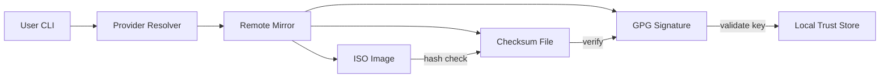

<!-- TABLE OF CONTENTS -->
<details>
  <summary>Table of Contents</summary>
  <ol>
    <li><a href="#about">about</a></li>
    <li><a href="#architecture">architecture</a></li>
    <li><a href="#features">features</a></li>
    <li><a href="#supported-distributions">supported distributions</a></li>
    <li><a href="#installation">installation</a></li>
    <li><a href="#usage">usage</a></li>
    <li><a href="#configuration">configuration</a></li>
    <li><a href="#project-structure">project structure</a></li>
    <li><a href="#faq">faq</a></li>
  </ol>
</details>

---

## about

Datacenter Image Trust is a CLI tool designed to securely download and verify Linux distribution images.

It ensures that downloaded ISO images are authentic and untampered by validating:

* GPG signatures  
* SHA256 checksums  
* trusted signing keys  
* allowed distribution hosts  

The tool is built for infrastructure, homelab, and security-focused environments where trust in downloaded artifacts is critical.

## architecture

> [!IMPORTANT]
> This tool enforces a full trust chain from download to verification.



## features

| feature | description |
|--------|------------|
| multi-distribution | Ubuntu, Debian, Fedora support |
| GPG verification | validates checksum signatures |
| SHA256 validation | ensures ISO integrity |
| trust policy | validates trusted keys and hosts |
| offline mode | verify previously downloaded images |
| JSON output | automation and scripting friendly |
| image listing | discover available ISOs |
| image selection | manually select specific ISO |
| progress display | real-time download feedback |

## supported distributions

| distribution | status | notes |
|-------------|--------|------|
| Ubuntu | stable | LTS and point releases supported |
| Debian | stable | archive + current releases |
| Fedora | stable | recent releases (tested: 42, 43) |

## installation

### 1. clone repository

```bash
git clone https://github.com/Pr0xyG33k/datacenter-image-trust.git
cd datacenter-image-trust
```

### 2. install dependencies

```bash
pip install -r requirements.txt
```

### 3. run tests (optional)

```bash
PYTHONPATH=src pytest -q
```

## usage

> [!NOTE]
> The tool automatically resolves ISO, downloads required artifacts, and verifies trust chain.

### basic usage

```bash
bin/datacenter-image-trust --release 24.04
```

### list available images

```bash
bin/datacenter-image-trust \
  --distribution ubuntu \
  --release 24.04 \
  --list
```

### select specific image

```bash
bin/datacenter-image-trust \
  --distribution ubuntu \
  --release 24.04 \
  --select ubuntu-24.04.4-desktop-amd64.iso
```

### offline verification

```bash
bin/datacenter-image-trust \
  --distribution fedora \
  --release 43 \
  --image-type server-netinst \
  --verify-only
```

### json output

```bash
bin/datacenter-image-trust \
  --distribution ubuntu \
  --release 24.04 \
  --json
```

### main options


`--distribution`   target distribution (ubuntu, debian, fedora)   
`--release`   release version or codename   
`--image-type`   type of ISO (server, desktop, netinst, etc.)   
`--list`   list available images   
`--select`   manually select ISO   
`--verify-only`   skip download, verify local files   
`--no-download`   disable downloads   
`--force-download`   re-download even if file exists   
`--json`   output result in JSON   
`--verbose`   enable detailed logs

## configuration
The tool relies on local configuration files:

### application configuration

```text
conf/application.yml
```

### distribution configuration

```text
conf/distributions/
  ubuntu.yml
  debian.yml
  fedora.yml
```

### trust store

```text
trust/
  <distribution>/
    keyrings/
    fingerprints/
```

## project structure

```text
src/
  datacenter_image_trust/
    cli.py
    downloader.py
    providers/
    models.py

conf/
  application.yml
  distributions/

trust/
  <distribution>/
    keyrings/
    fingerprints/

var/
  downloads/
  cache/

tests/
```

## faq

### why not use sha256sum manually?
Because the checksum itself must be trusted.  
This tool verifies checksum authenticity via GPG.

### why is gpg verification important?
Without signature validation, checksums can be replaced by malicious actors.

### why enforce trusted hosts?
To prevent downloads from untrusted mirrors or compromised sources.

### is this tool production-ready?
It is designed for homelab and infrastructure environments requiring strong verification guarantees.
